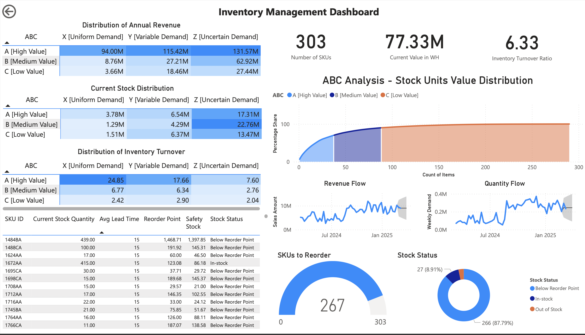

# Inventory Management Dashboard

This dynamic Power BI dashboard delivers comprehensive inventory analysis and management capabilities for warehouse operations. The solution leverages ABC-XYZ classification methodologies to optimize inventory control, identify high-value items, monitor demand patterns, and provide data-driven reordering recommendations. The dashboard serves as a strategic tool for inventory managers to minimize costs while maintaining appropriate stock levels across all product categories.

Each visualization is interactive, allowing users to filter by various dimensions including product category, ABC-XYZ classification, and stock status.



---

## 📂 About the Data

The dashboard is powered by two primary data sources, from which various derived elements (columns, tables, lookup values, and measures) are generated to support the visuals in the report.

1. **Stock Table**: Contains current inventory information including:
   - SKU ID (unique identifier)
   - Current Stock Quantity
   - Units (Nos/Kg)
   - Average Lead Time (days)
   - Maximum Lead Time (days)
   - Unit Price

2. **Past Orders**: Historical transaction data including:
   - Order Date
   - SKU ID
   - Order Quantity
   
---
## 📊 Data Profiling

Initial data exploration revealed the following characteristics:

1. **Data Completeness**:
   - No missing values (nulls) were identified in any of the key columns
   - All required fields were present and properly formatted in both tables

2. **Date Ranges**:
   - Order data spans across 2024 and 2025
   - Sufficient historical data available for trend and pattern analysis

3. **Data Structure**:
   - Stock table provided current inventory snapshot with 6 key fields
   - Past Orders table contained complete historical transaction records
   - No data type inconsistencies identified

These insights guided the development of the classification systems and dashboard visualizations to address specific inventory management challenges.

---

## Data Enrichments

*Look up Values, measures, columns and new tables are derived using the two sheets that are essentialy used in the power BI report.*

### ABC Classification (Value-Based Analysis)

**Annual Sales Quantity**: Calculates the total quantity of each SKU sold in the past 365 days.
```
Annual Sales Quantity =
CALCULATE(
   SUM('Past Orders'[Order Quantity]),
   FILTER(
       'Past Orders',
       DATEVALUE('Past Orders'[Order Date])>= TODAY()- 365 &&
       'Stock'[SKU ID] ='Past Orders'[SKU ID]
   )
) + 0
```
*Null handling: Adding "+ 0" ensures null values are converted to zeros*

**Annual Revenue**: Determines the total revenue generated by each SKU in the past year.
```
Annual Revenue = [Annual Sales Quantity] * [Unit Price]
```

**Revenue Share %**: Calculates each SKU's percentage contribution to total annual revenue.
```
Revenue Share % = 100 * Stock[Annual Revenue]/ SUM(Stock[Annual Revenue])
```

**Cumulative Share**: Computes running total of revenue percentages for Pareto analysis.
```
Cumulative Share = CALCULATE(SUM(Stock[Revenue Share %]),
filter(stock,Stock[Revenue Share %] >= EARLIER(Stock[Revenue Share %] )))
```

**ABC**: Column that Categorizes SKUs into A, B, or C classes based on cumulative revenue contribution.
```
ABC = if(Stock[Cumulative Share]<=70,"A [High Value]",
      if(Stock[Cumulative Share]<=90,"B [Medium Value]", 
      "C [Low Value]"))
```

**ABC Rank**: Ranks SKUs based on their cumulative revenue share position.
```
ABC rank = RANK.EQ(Stock[Cumulative Share], Stock[Cumulative Share], ASC)
```

### XYZ Classification (Demand Variability Analysis)

**Weekly Demand**: Calculates total demand for each SKU during a 7-day period.
```
Weekly Demand = CALCULATE(
   sum('Past Orders'[Order Quantity]),
   filter(
            'Past Orders',
            'Past Orders'[SKU ID] = 'Weekly Demand Sheet'[SKU ID] &&
            'Past Orders'[order date]>= 'Weekly Demand Sheet'[week] - 6 &&
            'Past Orders'[order date] <= 'Weekly Demand Sheet'[week].[Date]
   )
)
```

**Sales Amount**: Computes weekly revenue by multiplying unit price with weekly demand quantity.
```
Sales Amount = LOOKUPVALUE(Stock[Unit Price],Stock[SKU ID],
              'Weekly Demand Sheet'[SKU ID]) * 'Weekly Demand Sheet'[Weekly Demand]
```

**Average Weekly Demand**: Determines average weekly demand for each SKU
```
Average Weekly Demand = CALCULATE(
   AVERAGE('Weekly Demand Sheet'[Weekly Demand]),
   FILTER(
       'Weekly Demand Sheet',
       'Stock'[SKU ID] = 'Weekly Demand Sheet'[SKU ID]
   )
) + 0
```
*Null handling: Adding "+ 0" ensures null values are converted to zeros*

**Peak Weekly Demand**: Identifies the maximum historical weekly demand for each SKU.
```
Peak Weekly Demand = CALCULATE(
   MAX('Weekly Demand Sheet'[Weekly Demand]),
   FILTER('Weekly Demand Sheet',
          'Weekly Demand Sheet'[SKU ID] = 'Stock'[SKU ID])
)
```

**SD Of Weekly Demand**: Calculates how much the weekly demand typically deviates from the average weekly demand
```
SD Of Weekly Demand = CALCULATE(
   STDEV.P('Weekly Demand Sheet'[Weekly Demand]),
   FILTER(
           'Weekly Demand Sheet',
           'Stock'[SKU ID] = 'Weekly Demand Sheet'[SKU ID]
   )
) + 0
```
*Null handling: Adding "+ 0" ensures null values are converted to zeros*

**CV**: Computes coefficient of variation to standardize demand variability measurement.
```
CV = if(Stock[SD Of Weekly Demand]>0,
        Stock[SD Of Weekly Demand]/Stock[Average Weekly Demand],1000)
```
*Transformation: Using 1000 as a default value when SD is zero to avoid division by zero errors*

**CV Rank**: Ranks SKUs based on their demand variability (coefficient of variation).
```
CV Rank = RANK.EQ(Stock[CV], Stock[CV],1)
```

**XYZ**: Classifies SKUs into X, Y, or Z categories based on demand predictability.
```
XYZ = IF(
   Stock[CV Rank] < 0.2 * MAX(Stock[CV Rank]),
   "X [Uniform Demand]",
   IF(
       Stock[CV Rank] < 0.5 * MAX(Stock[CV Rank]),
       "Y [Variable Demand]",
       "Z [Uncertain Demand]"
   )
)
```

### Inventory Management Calculations

**Value in Warehouse**: Calculates the current monetary value of inventory for each SKU.
```
Value in WH = Stock[Current Stock Quantity] * Stock[Unit Price]
```

**Safety Stock**: Determines buffer inventory required to prevent stockouts during lead time variability.
```
Safety Stock = (Stock[Peak Weekly Demand]*Stock[Maximum Lead Time (days)]/7) -
               (Stock[Average Weekly Demand]*Stock[Average Lead Time (days)]/7)
```

**Reorder Point**: Identifies the inventory level at which a new order should be placed.
```
Reorder Point = Stock[Safety Stock] + 
               (Stock[Average Weekly Demand] * Stock[Average Lead Time (days)]/7)
```

**Inventory Turnover Ratio**: Measures how efficiently inventory is converted into sales across the entire warehouse.
```
Inventory Turnover Ratio = SUM(Stock[Annual Revenue])/sum(Stock[Value in WH])
```

**Items need to be Reordered?**: Flags SKUs that need replenishment based on current stock level and reorder point.
```
Items need to be Reordered? = if(Stock[Reorder Point]>Stock[Current Stock Quantity],
                                "Yes","No")
```

**SKUs to Reorder**: Counts the total number of unique SKUs currently requiring replenishment.
```
SKUs to Reorder = CALCULATE(COUNT(Stock[SKU ID]),
                           FILTER(Stock,
                                  Stock[Items need to be Reordered?]="Yes"))
```

**Stock Status**: Classifies each SKU's current inventory status into one of three categories.
```
Stock Status = if(Stock[Current Stock Quantity]=0, "Out of Stock", 
               if(Stock[Items need to be Reordered?]="Yes", 
               "Below Reorder Point", "In-stock"))
```

---


## 📈 Dashboard

The dashboard consists of the following key components:

1. **Key Metrics Cards**:
   - Total Number of SKUs
   - Inventory Turnover Ratio
   - Current Value in Warehouse

2. **Classification Analysis**:
   - ABC vs XYZ for Current Stock Distribution
   - ABC vs XYZ for Annual Revenue Distribution
   - ABC vs XYZ for Inventory Turnover Ratio
   - Pareto Chart with ABC classification

3. **Inventory Status Monitoring**:
   - Stock Status Donut Chart (Out of Stock/In-Stock/Below Reorder Point)
   - Reorder Gauge Chart showing number of SKUs requiring reordering
   - Detailed inventory management table

4. **Flow Tracking**:
   - Sales Amount trend with 10-day forecast
   - Weekly Demand trend with 10-day forecast


---

## 📝 Executive Summary

This inventory management dashboard transforms raw warehouse data into actionable intelligence through advanced analytics and visualization. By implementing ABC-XYZ classification methodology, the solution enables:

* **Strategic Inventory Allocation**
* **Demand-Based Reordering**
* **Operational Efficiency**
* **Comprehensive View of Inventory Health**

This allows management to:
1. Reduce overall inventory costs 
2. Improve service levels through optimized stock positioning
3. Increase inventory turnover by focusing on high-value items
4. Minimize stockouts through predictive reordering
5. Align inventory investments with business priorities
